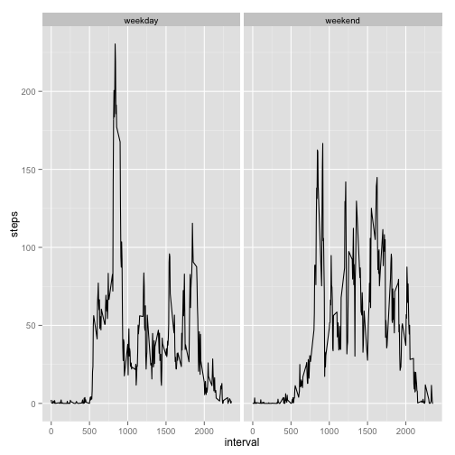

# Reproducible Research: Peer Assessment 1

## Loading and preprocessing the data

1. Load the data (i.e. read.csv())


```r
unzip("activity.zip")
df <- read.csv("activity.csv")
```

2. Process/transform the data (if necessary) into a format suitable for your 
analysis. I made also the aggregation needed **later** here.


```r
missingvalues <- which(rowSums(is.na(df))>0)
dfNA <-df[missingvalues,]
dfNoNA <- df[-(missingvalues),]
dfNA$steps <- NULL
steps_mean_5minutes <- aggregate(dfNoNA$steps, list(dfNoNA$interval), FUN=mean)
names(steps_mean_5minutes) <- c("interval", "steps")
```

## What is mean total number of steps taken per day?

1. Make a histogram of the total number of steps taken each day


```r
steps_daily <- aggregate(df$steps, list(df$date), FUN=sum)
names(steps_daily) <- c("Date","Steps")
hist(steps_daily$Steps, breaks=30, xlab="Daily steps", 
     main="Total number of steps taken each day")
```

 

2. Calculate and report the mean and median total number of steps taken per day

Mean steps each day

```r
mean(steps_daily$Steps, na.rm=T)
```

```
## [1] 10766
```

Median steps each day

```r
median(steps_daily$Steps, na.rm=T)
```

```
## [1] 10765
```

## What is the average daily activity pattern?

1. Make a time series plot (i.e. type = "l") of the 5-minute interval (x-axis) 
and the average number of steps taken, averaged across all days (y-axis). 


```r
library(ggplot2)
ggplot(steps_mean_5minutes, aes(x=interval, y=steps)) + geom_line()
```

 

Which 5-minute interval, on average across all the days in the dataset, 
contains the maximum number of steps?


```r
maxSteps <- max(steps_mean_5minutes$steps)
subset(steps_mean_5minutes, steps==maxSteps)
```

```
##     interval steps
## 104      835 206.2
```

## Imputing missing values

1. Calculate and report the total number of missing values in the dataset 
(i.e. the total number of rows with NAs)


```r
length(missingvalues)
```

```
## [1] 2304
```

2. Devise a strategy for filling in all of the missing values in the dataset. 
The strategy does not need to be sophisticated. For example, you could use 
the mean/median for that day, or the mean for that 5-minute interval, etc.
**Comment: Here NA values are given mean value of that particular interval.**


```r
dfNA <- merge(x = dfNA, y = steps_mean_5minutes, by = "interval", all.x=TRUE)
```

3. Create a new dataset that is equal to the original dataset but with the 
missing data filled in.


```r
df_new <- rbind(dfNA,dfNoNA)
```

4. Make a histogram of the total number of steps taken each day and Calculate and 
report the mean and median total number of steps taken per day. Do these values 
differ from the estimates from the first part of the assignment? What is the 
impact of imputing missing data on the estimates of the total daily number of 
steps?


```r
steps_sum_day <- aggregate(df_new$steps, list(df_new$date), FUN=sum)
hist(steps_sum_day$x, breaks=30, xlab="Daily steps", 
     main="Total number of steps taken each day with filled data")
```

 

```r
mean(steps_sum_day$x, na.rm=T)
```

```
## [1] 10766
```

```r
median(steps_sum_day$x, na.rm=T)
```

```
## [1] 10766
```

Median changes slightly, since values are skeved little bit to left. 

## Are there differences in activity patterns between weekdays and weekends?

1. Create a new factor variable in the dataset with two levels -- "weekday"
and "weekend" indicating whether a given date is a weekday or weekend day.


```r
weekend <- c("Saturday", "Sunday")
weekday <- ifelse(weekdays(as.Date(df_new$date)) %in% weekend, 
               "weekend", "weekday")
df_new$weekday <- as.factor(weekday)
```

2. Make a panel plot containing a time series plot (i.e. type = "l") 
of the 5-minute interval (x-axis) and the average number of steps taken, 
averaged across all weekday days or weekend days (y-axis).


```r
weekdays <- subset(df_new, weekday=="weekday")
weekend <- subset(df_new, weekday=="weekend")
weekdays <- aggregate(weekdays$steps, list(weekdays$interval), FUN=mean)
weekend <- aggregate(weekend$steps, list(weekend$interval), FUN=mean)
names(weekdays) <- c("interval","steps")
names(weekend) <- c("interval","steps")
weekdays$name <- "weekday"
weekend$name <- "weekend"
x <- rbind(weekend, weekdays)
ggplot() + facet_wrap(~name) + geom_line(data=x, aes(x=interval, y=steps))
```

 
